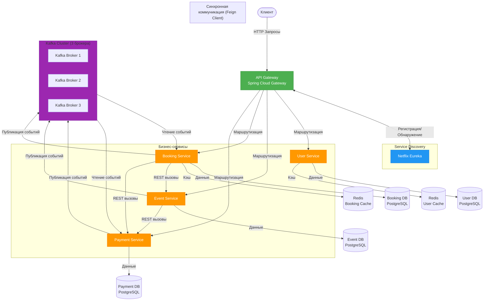

# Bileton
Bileton — это аналог Яндекс Афиши, предоставляющий возможность площадкам размещать мероприятия, а пользователям — просматривать события по категориям, бронировать билеты и управлять заказами. Платформа обеспечивает согласование площадок и цен с администрацией перед публикацией.

# Быстрый старт

### Требования к окружению 
- Docker & Docker Compose v2+
- OpenSSL (для генерации ключей)

### Запуск через docker compose
Все сервисы настроены для запуска через docker compose.

Также необходимо сгенерировать приватный и публичный ключи для аутентификации.

```bash
git clone <repository-url>
cd bileton

docker network create kafka-net
docker network create eureka-net

mkdir -p user-service/src/main/resources/keys
mkdir -p event-service/src/main/resources/keys
mkdir -p booking-service/src/main/resources/keys
mkdir -p payment-service/src/main/resources/keys
mkdir -p api-gateway/src/main/resources/keys

cd user-service/src/main/resources/key

# Генерация приватного ключа
openssl genpkey -algorithm RSA -out private_key.pem -pkeyopt rsa_keygen_bits:2048

# Извлечение публичного ключа из приватного
openssl rsa -pubout -in private_key.pem -out public_key.pem

cp public_key.pem ../../../event-service/src/main/resources/keys/
cp public_key.pem ../../../booking-service/src/main/resources/keys/
cp public_key.pem ../../../payment-service/src/main/resources/keys/
cp public_key.pem ../../../api-gateway/src/main/resources/keys/

cd ../../../..

docker compose up -d
```

В случае точечного запуска сервисов:
```bash
cd /need-service
# если сервис требует .env.docker.example
docker compose --env-file=.env.docker.example up --build -d
# если нет 
docker compose up --build -d
```
Для комфортного запуска рекомендуется от 16гб озу

# Архитектура системы
Проект построен на микросервисной архитектуре с использованием Spring Cloud и асинхронной коммуникации через Apache Kafka.

### Технологический стек
- Java 17+
- Spring Boot 4.x
- Spring Cloud (Gateway, Netflix Eureka, OpenFeign)
- Apache Kafka — асинхронная коммуникация
- PostgreSQL — основная база данных
- Redis
- Docker & Docker Compose — контейнеризация
- Swagger/OpenAPI — API документация
- Gradle — сборка проекта

### Компоненты системы

- API Gateway (Spring Cloud Gateway) — единая точка входа для всех клиентских запросов.
- Service Discovery (Netflix Eureka) — регистрация и обнаружение сервисов.
- Бизнес сервисы:
    - user-service - управление пользователями и аутентификация;
    - event-service - сервис площадок и мероприятий;
    - booking-service - сервис бронирования и управления билетами;
    - payment-service - сервис оплаты.
- Базы данных:
    - SQL: Postgres - каждый сервис, требующий базу данных, имеет свою собственную.
    - NoSQL: Redis - используется для хранения refresh-токенов, а также для первичного бронирования.
- Apache Kafka - асинхронная коммуникация между сервисами.

### Схема взаимодействия


# Документации(кратко)

> 🌐 **Общая агрегированная документация (API Gateway):** [Swagger UI](http://localhost:8080/swagger-ui/index.html)

### user-service
Сервис отвечает за аутентификацию, регистрацию и управление пользователями. Использует JWT токены для авторизации.

| Метод | Endpoint | Request Body | Response | Auth |
|-------|----------|--------------|----------|------|
| POST | `/api/v1/auth/register` | `RegistrationRequestDto` | `UserResponse` | — |
| POST | `/api/v1/auth/login` | `LoginRequestDto` | `TokenResponse` | — |
| POST | `/api/v1/auth/refresh` | `RefreshTokenRequest` | `TokenResponse` | — |
| POST | `/api/v1/auth/logout` | `RefreshTokenRequest` | `204 No Content` | ✅ |
| GET | `/api/v1/users/me` | — | `UserResponse` | ✅ |

> **Ключ:** ✅ — требуется Bearer токен, — — без аутентификации
> 🔗 **Полная документация:** [User Service Swagger](http://localhost:8081/swagger-ui/index.html)  


#### Аутентификация и авторизация
Система использует JWT (JSON Web Tokens) с алгоритмом подписи RSA-256.

Архитектура ключей:
- User Service хранит приватный ключ (private.key) для подписи токенов и публичный ключ (public.key) для их верификации
- Остальные сервисы (Event, Booking, Payment) хранят только публичный ключ для проверки подлинности токенов

Flow:
- Пользователь регистрируется/логинится → получает пару токенов
- Access токен передается в заголовке Authorization: Bearer token
- При истечении access токена используется refresh токен для получения новой пары
- Logout аннулирует refresh токен на сервере


### Event Service

| Метод | Endpoint | Request Body | Response | Auth |
|-------|----------|--------------|----------|------|
| GET | `/api/v1/events` | `EventFilter`, `Pageable` (query) | `EventSummary[]` | ✅ |
| POST | `/api/v1/events` | `EventDetailsRequest` + `Idempotency-Key` | `EventDetailsResponse` | ✅ |
| PATCH | `/api/v1/events/{eventId}` | `EventInfoPatch` | `EventSummary` | ✅ |
| POST | `/api/v1/events/{eventId}/publish` | — | `EventSummary` | ✅ |
| POST | `/api/v1/events/{eventId}/cancel` | — | `EventSummary` | ✅ |
| GET | `/api/v1/events/types` | — | `EventType[]` | ✅ |
| GET | `/api/v1/venues` | — | `VenueSummaryResponse[]` | ✅ |
| POST | `/api/v1/venues` | `VenueDetailsRequest` + `Idempotency-Key` | `VenueDetailsResponse` | ✅ |
| GET | `/api/v1/venues/{id}` | — | `VenueDetailsResponse` | ✅ |
| PATCH | `/api/v1/venues/{id}` | `VenueInfoPatch` | `VenueSummaryResponse` | ✅ |

> **Ключ:** ✅ — требуется Bearer токен, — — без аутентификации  
> 🔗 **Полная документация:** [Event Service Swagger](http://localhost:8082/swagger-ui/index.html)  


### Booking Service

| Метод | Endpoint | Request Body | Response | Auth |
|-------|----------|--------------|----------|------|
| POST | `/api/v1/bookings` | `BookingRequestDto` | `BookingDetailsResponse` | ✅ |
| GET | `/api/v1/bookings` | — | `BookingInfoResponse[]` | ✅ |
| GET | `/api/v1/bookings/{bookingId}` | — | `BookingDetailsResponse` | ✅ |
| POST | `/api/v1/bookings/{bookingId}/cancel` | — | `BookingDetailsResponse` | ✅ |
| GET | `/api/v1/tickets` | — | `TicketSummaryResponse[]` | ✅ |
| GET | `/api/v1/tickets/{ticketId}` | — | `TicketDetailsResponse` | ✅ |

> **Ключ:** ✅ — требуется Bearer токен, — — без аутентификации  
> 🔗 **Полная документация:** [Booking Service Swagger](http://localhost:8083/swagger-ui/index.html)  


### Payment Service

| Метод | Endpoint | Request Body | Response | Auth |
|-------|----------|--------------|----------|------|
| POST | `/api/v1/payments` | `CreatePaymentRequest` + `Idempotency-Key` | `PaymentResponseDto` | ✅ |
| GET | `/api/v1/payments` | — | `PaymentResponseDto[]` | ✅ |
| GET | `/api/v1/payments/{paymentId}` | — | `PaymentResponseDto` | ✅ |

> **Ключ:** ✅ — требуется Bearer токен, — — без аутентификации  
> 🔗 **Полная документация:** [Payment Service Swagger](http://localhost:8084/swagger-ui/index.html)  


### API Gateway

| Метод | Endpoint | Request Body | Response | Auth |
|-------|----------|--------------|----------|------|
| GET | `/events/{eventId}/availability` | — | `EventDetailsResponse` (агрегированные данные) | ✅ |

> **Описание:** Агрегирует данные из Event Service и Booking Service для отображения актуальной доступности мест с интерактивной схемой зала.  
> 🔗 **Полная документация:** [API Gateway Swagger](http://localhost:8080/swagger-ui/index.html)  

